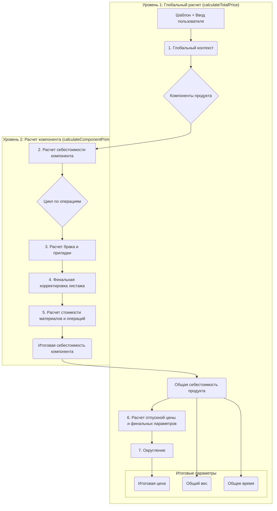

# Анализ и структура `PriceCalculationService`

`PriceCalculationService` — это ядро системы калькуляции стоимости продукции. Он использует многоуровневую модель расчета, комбинируя статические данные из сущностей (материалы, оборудование) с динамически вычисляемыми параметрами через Groovy-формулы.

## Общая структура расчета

Расчет стоимости продукта — это многоэтапный процесс, который можно визуализировать как воронку, где на каждом этапе уточняются параметры и накапливается итоговая стоимость.

## Уровни расчета и используемые переменные

### Уровень 1: Глобальный расчет (`calculateTotalPrice`)

Это верхнеуровневый метод, который управляет всем процессом.

1.  **Инициализация Глобального Контекста (`buildInitialContext`)**:
    *   Создается `Map<String, Object> globalContext`.
    *   **Переменные**:
        *   Из `Templates`: Загружаются переменные по умолчанию для всего продукта (например, `margin`, `tax`, `banking`, `worker_rate`, `roundMask`).
        *   Из `userInputs`: Пользовательский ввод (например, `quantity`, `sizeX`, `sizeY`) добавляется в контекст, переопределяя значения по умолчанию.

2.  **Расчет себестоимости по компонентам**:
    *   Сервис итерирует по всем компонентам (`AbstractProductType`) шаблона.
    *   Для каждого компонента вызывается `calculateComponentPrimeCost`.
    *   Результаты суммируются в `totalPrimeCost`.

3.  **Расчет отпускной цены**:
    *   **Финансовая модель**: На этом этапе происходит переход от себестоимости к цене продажи.
    *   **Переменные из контекста**: `margin`, `tax`, `banking`.
    *   **Формула**: `sellingPrice = totalPrimeCost * (1 + margin/100) * (1 + tax/100) * (1 + banking/100)`

4.  **Округление**:
    *   **Динамическая формула**: `roundMask` (например, `'#.##'`). Эта формула *выполняется*, что позволяет создавать динамические маски округления в зависимости от тиража или суммы.
    *   Цена за единицу (`pricePerOne`) форматируется согласно маске.
    *   Вычисляется итоговая цена за весь тираж.

### Уровень 2: Расчет себестоимости компонента (`calculateComponentPrimeCost`)

Этот метод фокусируется на расчете "физических" и стоимостных показателей для одного компонента продукта (например, "обложка" или "внутренний блок").

1.  **Инициализация Контекста Компонента**:
    *   Создается локальная копия глобального контекста.
    *   **Переменные**: Добавляются переменные из `AbstractProductType`, которые могут переопределить глобальные.

2.  **Подготовка к расчету раскладки (`setupContext`)**:
    *   **Физическая модель**: Определяются физические параметры печатного листа.
    *   **Переменные**: В контекст добавляются:
        *   `mainMaterialWidth`, `mainMaterialLength`: Размеры листа материала.
        *   `mainMaterialWorkAreaWidth`, `mainMaterialWorkAreaLength`: Рабочая область листа с учетом максимальных незапечатываемых полей (`gap_*`) со всех машин, участвующих в операциях.

3.  **Выполнение формулы раскладки (`setupFormula`)**:
    *   **Динамическая формула**: Это ключевая формула физической модели. Она использует размеры изделия (`sizeX`, `sizeY`) и рабочую область листа для расчета количества изделий на листе и общего количества листов.
    *   **Переменные, которые вычисляет формула**:
        *   `quantityProductsOnMainMaterial`: Количество изделий, помещающихся на одном печатном листе.
        *   `requiredSheets`: Необходимое количество листов для печати тиража (без учета брака).

4.  **Расчет брака и приладки (Цикл по операциям)**:
    *   **Физическая модель**: Моделируется увеличение количества материала и времени на брак и приладку для каждой технологической операции.
    *   **Динамические формулы**:
        *   `wasteExpression`: Увеличивает `finalQuantity` (тираж с учетом брака). Пример: `finalQuantity += finalQuantity * 0.01 + 5`.
        *   `setupExpression`: Увеличивает `maxSetupWasteEquivalent` (эквивалент приладки в листах). Пример: `maxSetupWasteEquivalent = Math.max(maxSetupWasteEquivalent, 10)`.
    *   **Переменные**: `finalQuantity` и `maxSetupWasteEquivalent` итеративно обновляются в цикле.

5.  **Финальная корректировка листажа (`finalAdjustmentFormula`)**:
    *   **Динамическая формула**: Связывает обновленный тираж (`finalQuantity`) и приладку (`maxSetupWasteEquivalent`) с итоговым количеством листов.
    *   **Переменные, которые вычисляет формула**:
        *   `finalSheets`: Итоговое количество листов с учетом всего брака и приладки. Пример: `finalSheets = Math.ceil(finalQuantity / quantityProductsOnMainMaterial) + maxSetupWasteEquivalent`.

6.  **Расчет себестоимости**:
    *   **Финансовая модель**: На этом этапе физические величины (листы, секунды) конвертируются в деньги.
    *   **Стоимость основного материала**:
        *   `finalSheets` * `цена листа` (получается из репозитория `PriceOfMaterialRepository`).
    *   **Стоимость операций (в цикле)**:
        *   **Динамические формулы**:
            *   `machineTimeExpression`: Рассчитывает время работы оборудования в секундах.
            *   `actionTimeExpression`: Рассчитывает время ручной работы в секундах.
            *   `materialAmountExpression`: Рассчитывает количество расходного материала операции (например, количество кликов для цифровой машины).
        *   **Стоимость**:
            *   Время работы машины (`machineTime`) умножается на стоимость часа работы (`цена из PriceOfMachineRepository`).
            *   Время ручной работы (`actionTime`) умножается на ставку сотрудника (`worker_rate` из контекста).
            *   Расход материала (`materialAmount`) умножается на его цену (`цена из PriceOfMaterialRepository`). 
    *   Все стоимости **суммируются** в `componentPrimeCost`.
    *   **Параллельный расчет времени**:
        *   Вычисляется чистое время операции: `operationTime = Math.max(machineTime, actionTime)`.
        *   Это время **суммируется** в глобальной переменной `totalManufacturingTime`.

## Разделение на физическую и финансовую модель

Сервис элегантно разделяет эти две модели. Параллельно с финансовым расчетом идет расчет физических параметров.

### Физическая модель

*   **Что это**: Расчет количественных, физических показателей: сколько изделий помещается на листе, сколько всего нужно листов, сколько времени займет работа.
*   **Где происходит**: В основном внутри `calculateComponentPrimeCost`.
*   **Ключевые формулы**:
    *   `setupFormula` (раскладка).
    *   `wasteExpression` (брак в штуках).
    *   `setupExpression` (приладка в листах).
    *   `finalAdjustmentFormula` (итоговое количество листов).
    *   `machineTimeExpression` (вычисляет `machineTime`).
    *   `actionTimeExpression` (вычисляет `actionTime`).
    *   `materialAmountExpression` (расходники операции).
*   **Ключевые переменные**:
    *   `totalWeight`: Глобальный аккумулятор веса. Рассчитывается на основе площади/количества основного материала и его плотности.
    *   `totalManufacturingTime`: Глобальный аккумулятор времени. В каждой операции вычисляется `operationTime = Math.max(machineTime, actionTime)`, и это значение суммируется в `totalManufacturingTime`.
*   **Результат**:
    *   Количество листов (`finalSheets`).
    *   Количество секунд работы (`machineTime`, `actionTime`) для расчета стоимости.
    *   Количество расходников (`materialAmount`).
    *   **Итоговые физические параметры**: `totalWeight` (общий вес) и `totalManufacturingTime` (чистое время изготовления).

### Финансовая модель

*   **Что это**: Преобразование физических показателей в денежный эквивалент (себестоимость) и последующий расчет отпускной цены.
*   **Где происходит**: Частично в `calculateComponentPrimeCost` (расчет себестоимости) и в основном в `calculateTotalPrice` (расчет отпускной цены).
*   **Ключевые переменные и данные**:
    *   Цены на материалы и работу оборудования (из `PriceOf...Repository`).
    *   `worker_rate` (ставка сотрудника).
    *   `margin`, `tax`, `banking` (коммерческие коэффициенты).
    *   `roundMask` (правило округления).
*   **Результат**: Итоговая цена для клиента (`finalPrice`).

Это разделение позволяет независимо настраивать технологические процессы (изменяя формулы физической модели) и коммерческую политику (изменяя переменные финансовой модели). В результате работы вычислителя мы получаем объект `CalculationReport`, из которого можно получить три независимых параметра: **цена**, **вес** и **время изготовления**.

Надеюсь, этот детальный разбор и предложенные изменения будут вам полезны!
